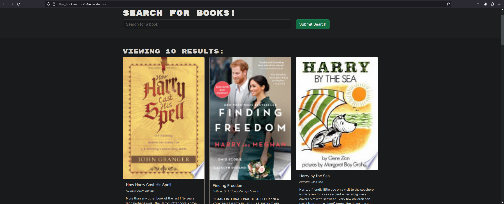

  # Book Search

  

  ## Description

  - Motivation: My motivation was to practice and develop my skills with apollo and auth.
  - Problem solved: I am struggling to get a solid grasp on apollo and especially auth.
  - What was learned: I have learned a lot but what i have learned the most tis time, is that i really don't know.

  ## Table of Contents

  - [Installation](#installation)
  - [Usage](#usage)
  - [Credits](#credits)
  - [License](#license)
  - [Badges](#badges)
  - [Features](#features)
  - [Contribute](#contribute)
  - [Tests](#tests)
  - [Contact](#contact)

  ## Installation

  - navigate to the depolyed project

  ## Usage

  - use the deployed project
  - Deployed Project link -> https://book-search-v056.onrender.com

      

  ## Credits

  - I would like to give some thanks to [Malisa Litten](https://github.com/Malili05) and [Landon](https://github.com/LandoCodesRissian)

  ## License

  - This project is being covered under the MIT license

  - A list of available licenses and their meanings can be found here: [https://choosealicense.com/](https://choosealicense.com/)

  ## Badges

    
  
  ## Features

  - Ability to save and delete books from your account.

  ## Contribute

  - I would love some help, PLEASE!

  ## Tests

  - no tests

  ## Contact

  - Ways you can contact me for any questions: https://github.com/ProgramerNinja
